## Black Swans, Python 2020, and the Modern Web

##### Paul Everitt, @paulweveritt

----  ----

## Apologies, Assembled Late

----  ----

## About Me

Developer Advocate for PyCharm.

----  ----

### Old

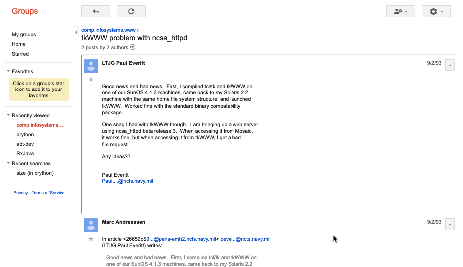

----  ----

## Hypothesis

Python has a blind spot regarding the "modern web". As Russell Keith-Magee and 
Lukasz Langa recently highlighted, this could be a mortal threat. 

Let's explore.

----  ----

## Outline

- Previous Art: Black Swans, Python 2020
- "Modern Web"?
- How's Python Doing?
- Python and the Modern Web
- Action

----  ----

## Black Swans

----  ----

### What Surprise Could Happen Which Dramatically Alters Popularity?

----  ----

### Best Solution: Actively Challenge Assumptions

----  ----

### Python Web Development

- Then: Code on server, HTML/CSS, a little Ajax
- Now: More code/value in browser
- Progression:
    - Optional client enhancement became...
    - Key business logic in browser, becomes...
    - Replace Python on server

----  ----

### Rather Than Wait for Wildfire...

...clear the forest.

----  ----

### First, Start a Conversation

----  ----

### WASM: The Winged Keel

- WebAssembly (WASM)
- It's early days
- Exploit to our advantage...
- ...instead of complaining when we don't win anymore
- Some personal experience on this

----  ----

### Beyond Web 2.0

- "Isomorphic JavaScript" without the JS part

----  ----

## Python 2020

----  ----

### Data Science Saved Python

- During Python 2->3
- We could have been dead already
- Jupyter was perhaps a Black Swan

----  ----

### Dueling Stats

- Python is "most wanted" language
- But trails JS/HTML/CSS on "most popular"

----  ----

### Assertion

Providing a *clear*, *supported* client-side story is what Python needs.

----  ----

### Need a *New* Kind of Python

- Python *compiler* for the web (i.e. transpiler)
- *Not* a Python-interpreter-in-the-browser
    - Too big
    - Orders of magnitude slower
- Must be "viable for professional, production use"

----  ----

### Very, Very Good Talk

----  ----

## Modern Web

- Drivers, stats, metrics
- PWA, specifically
- PRPL, specifically
-  Gatsby, specifically
- Mortal threats

----  ----

### Drivers

- Catch native mobile (PWA)
- High performance in constrained environments (PRPL)
  - aka "Cheap Phones on 2G"
  - Bandwidth, CPU, battery
- Business Stats 

----  ----

### Stats

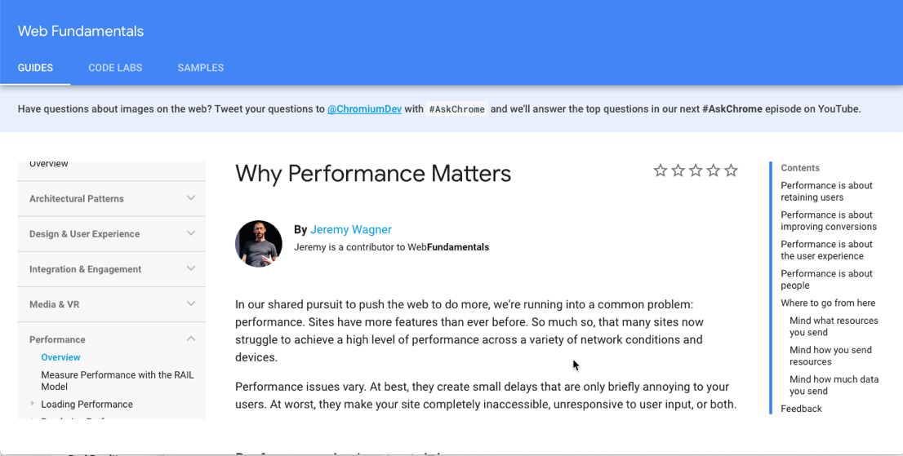

----  ----

### Stats

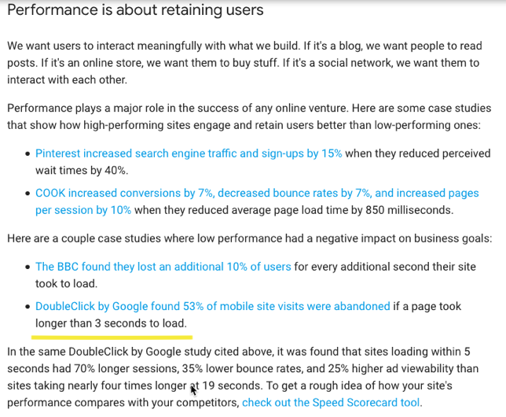

----  ----

### Stats

----  ----

### Flipkart PWA

- Small team, 42 days
- 3x time spent on site
- 40% higher re-engagement
- 70% higher conversion vis Add To Homescreen
- 3x lower data usage

----  ----

### Stats: SEO

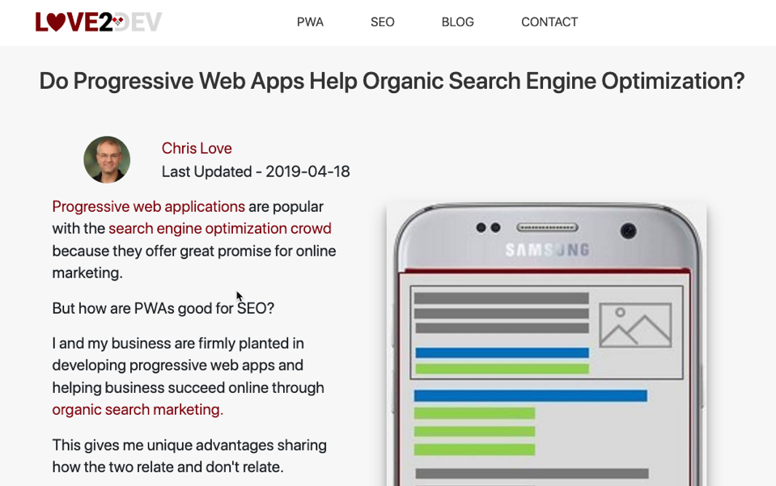

----  ----

### Stats: SEO

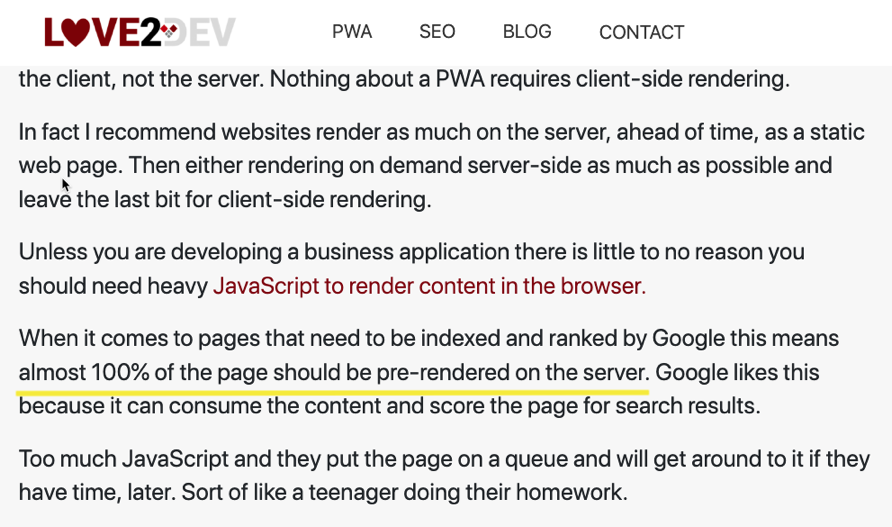

----  ----

### Metrics

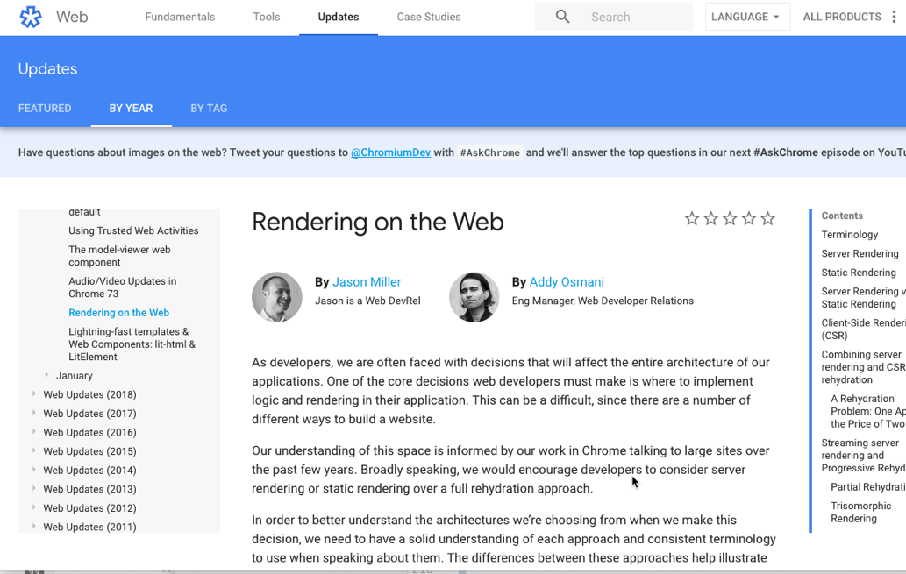

----  ----

### Jargon

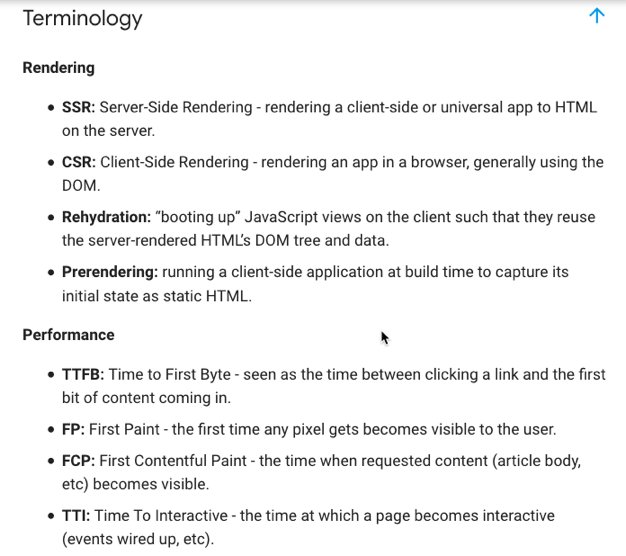

----  ----

### Asteroid, Meet Earth

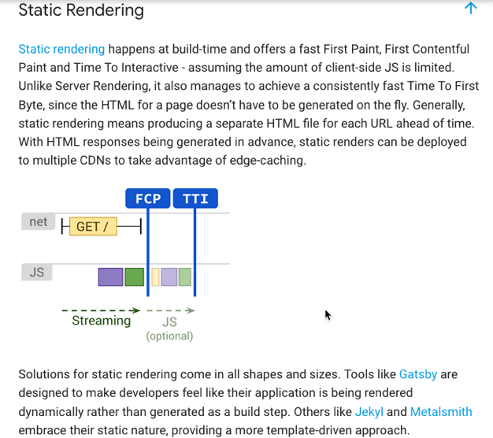

----  ----

### PWA: Mobile Apps, For Web

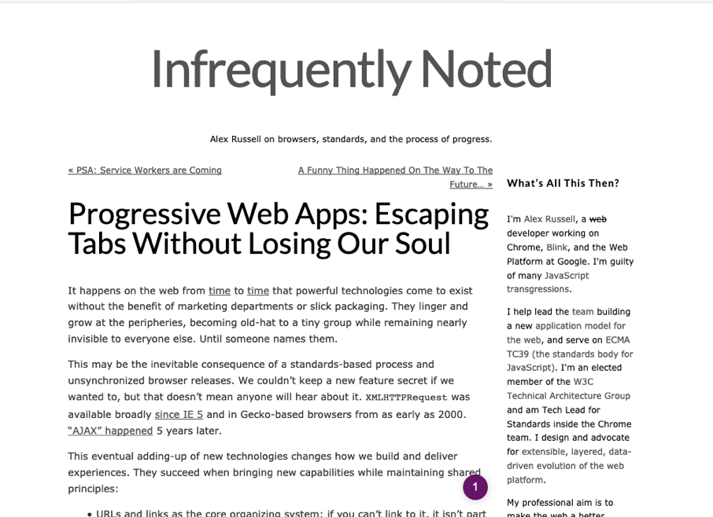

----  ----

### PWA, Specifically

- Manifest, HTTPS, service worker
- Sort of:
    - App shell
    - Fetch, Cache, Sync APIs

----  ----

### PRPL

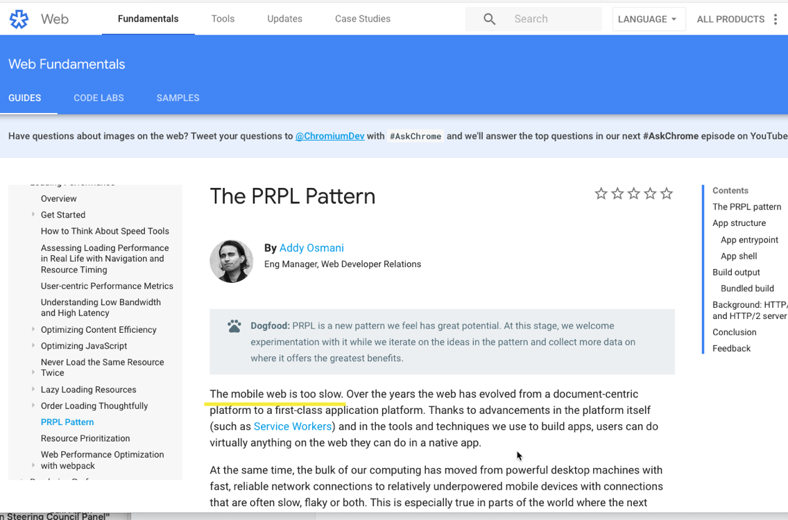

----  ----

### PRPL Means

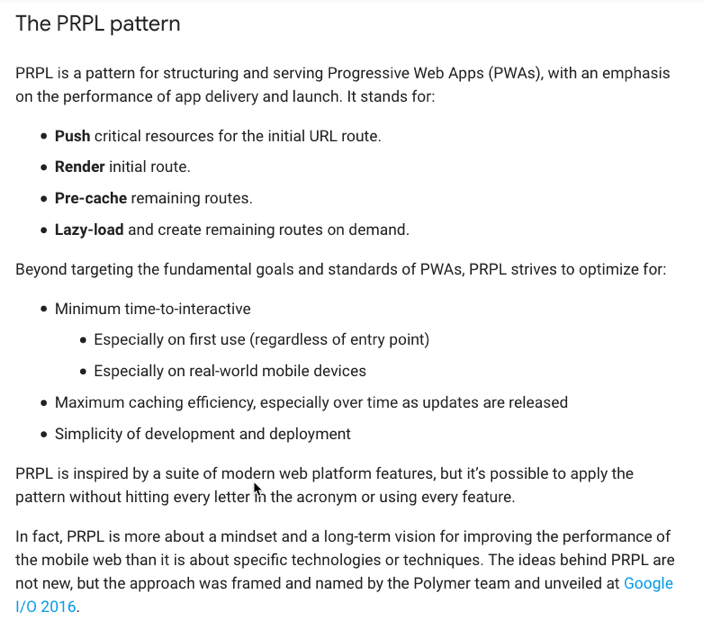

----  ----

### PRPL Implies

- App shell
- Client-side routing
    - ...which implies components/templates
- Code-splitting with lazy loading
- SSR? If so:
    - All of that...*also* on the server

----  ----

### GatsbyJS

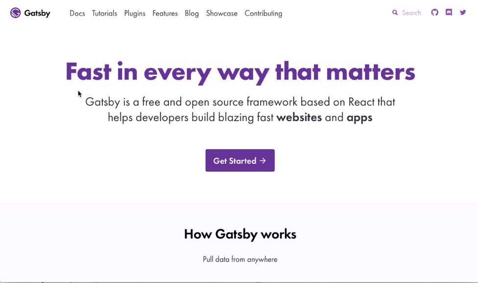

----  ----

### "Compiled" Web Sites: It's Fast

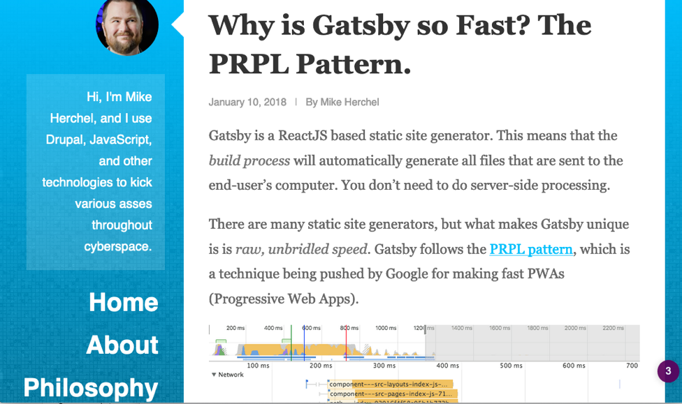

----  ----

### Things It Does OOTB

- It's going to be a long list
- Ask yourself: "When did I last hear a Python person care about that?"

----  ----

### Things It Does OOTB

- SSR/CSR in React and VDOM
- Service worker with HTTP/2 Push of "critical resources"
- Easily make offline-first
- Code-splitting
- Progressively (no JS)

----  ----

### Things It Does OOTB

- AppShell
- Pre-fetch and cache site navigation
- Ditto for "coming into viewport"
- Inline CSS on the critical rendering path
- Responsive/progressive images with placeholders and intersection observer
- Semi-interesting content architecture based on GraphQL

----  ----

### Living With Gatsby

- Thousands of npm packages means...
- Thousands of vulnerabilities
- The poster child of JS Toolchain Hell
- More architecture than they can deal with

----  ----

### Mortal Threats

- SSR
- VDOM
- Web Components
- Others: client-side routing, binary AST, ...

----  ----

## How's Python Doing?

----  ----

### Death by Success

- As Lukazs mentioned, mega-popular
- Django and Flask are super popular
- REST has solved the problem, amirite?
- But this leads to the blind spots of black swans
- Exemplar: Whither the PyCon web talks?

----  ----

### Future Budget Allocation

- Projects have budgets
- Money/code/HR/performance/value
- If JS can do the bigger/better budget slice...
- ...why do I need Python?

----  ----

### Consulting Decision

- "REST lets me do frontend/backend"
- Customer is happy, consultant is happy...is "Python" happy?
- Each line done in JS is a shovel of dirt
- Can't expect customer/consultant to be unhappy

----  ----

## Python and the Modern Web

We're not competitive, even on templating. Much less "components 
that rehydrate on load."

----  ----

### "Interpreter" (Runtime)

- Transcrypt
- mypyc
- MicroPython/JS
- WASM

----  ----

### My Interest: Transcrypt

- Mature
- Feasible now
- ESM
- Needs a "HyperApp" in Python

----  ----

### Other

- Templating
- Views
- State
- Components (the three above)
- DX, e.g. devserver

----  ----

## Action

- Conversation: Is This Important?
- What is "This"?
- Start storytelling
- Organize the surface area
- A killer app

----  ----

## Catch Up? Kick Ass!